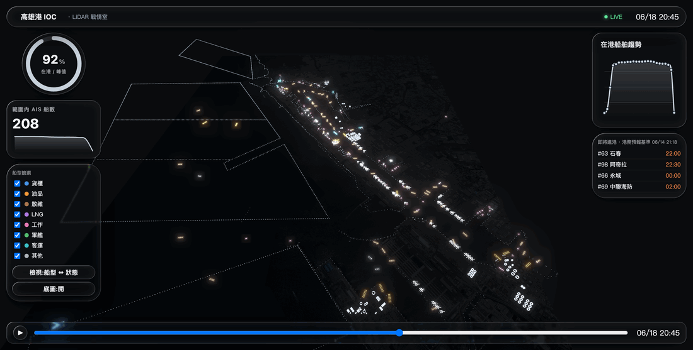

# lidar-engine

A reusable LiDAR-style point-cloud scanning engine for the web (Scanner Sombre style), built on Three.js + three-mesh-bvh. A fixed core pipeline reveals a scene as an accumulating, depth-colored point cloud; three swappable slots (what is scanned, how rays are cast, how distance maps to color) let you retarget it without touching the core.

## Showcase — 高雄港 LiDAR 戰情室 (Kaohsiung port digital twin)

A dark "situation-room" digital twin of the Port of Kaohsiung, built on this engine from **real geographic data** — OSM coastline / piers / breakwaters / storage tanks / cranes / anchorages, an NLSC aerial orthophoto basemap, **real AIS ship tracks** (Taiwan MPB public feed) replayed on a 24-hour timeline, and **official surveyed berth coordinates** (Taiwan Port Corp. KHB feed) — all on one shared local projection.



Each feature category is an independent point-cloud layer (config-driven registry) with its own colour / brightness / size / glow; storage tanks and cranes are rendered as 3D point volumes. Selective multi-group bloom, a scrub-able 24-hour occupancy timeline, ship-type vs status views, in-scene **berth-number labels** at real coordinates (aligned with the live AIS ships), and live tuning via `window.__twin`. The colour hierarchy keeps saturated **ships** (data) and the red **incoming** marker (alert) reading against neutral-grey **landmarks** and dim cool-grey **structure**.

```bash
npm run dev
# open the printed URL, then go to /examples/kaohsiung-port/index.html
```

**Operate it:** drag to orbit (the pivot recenters on the middle of your view) · scroll to zoom · **↑↓←→** pan along the ground · **Space / Left-Ctrl** rise / descend · hold **Left-Shift** to move faster · scrub or ▶ the timeline to watch a day of traffic.

Data is read from frozen, reproducible snapshots; refresh them with `npm run port:fetch` (TWPort), `npm run port:osm` (OSM), `npm run port:basemap` (NLSC). See [docs/vscode-dev-guide.md](docs/vscode-dev-guide.md) for the tuning/dev guide and `docs/superpowers/` for the specs & plans.

## Install

```bash
npm install
```

## Run the engine demo

```bash
npm run dev
# open the printed URL, then go to /examples/basic/index.html
```

The cave demo for the bare engine: move the mouse to scan the darkness, drag to look around, Space to clear. The HUD buttons swap the color ramp, emitter, and persistence mode live.

## Test

```bash
npm test
```

## Usage

```ts
import { LidarEngine, emitters, ramps, scannables } from 'lidar-engine';

const engine = new LidarEngine({
  canvas: document.querySelector('#view'),
  scannable: scannables.proceduralCave(), // swappable slot: what is scanned
  emitter: emitters.cursorCone({ halfAngle: 0.1, raysPerFrame: 400 }), // how rays are cast
  ramp: ramps.rainbowDepth, // distance -> color
  pointBudget: 500_000,
  persistence: 'accumulate', // or 'fade'
});
engine.start();

engine.aimAt(clientX, clientY); // aim the scan from a cursor position
engine.look(dx, dy);            // drag to look around
engine.setRamp(ramps.thermal);  // live recolor (no rescan)
engine.setEmitter(emitters.pulseRing({ speed: 8 }));
engine.clear();
```

## Architecture

Fixed core pipeline — **Emitter -> RaycastSampler -> PointCloud -> Renderer** — with three swappable slots:

- **Scannable** (`scannables.proceduralCave()`, `scannables.loadGLTF(url)`) — the geometry being scanned (raycast-only; never rendered).
- **Emitter** (`emitters.cursorCone`, `emitters.autoSweep`, `emitters.pulseRing`) — produces the rays cast each frame.
- **Color ramp** (`ramps.rainbowDepth`, `ramps.thermal`, `ramps.monoNeon`, or your own `(dist01) => [r,g,b]`) — maps normalized distance to color via a GPU LUT, so recoloring is instant.

Rays are cast against the scannable's meshes with BVH acceleration (three-mesh-bvh); each hit becomes a persistent colored point in a preallocated GPU ring buffer (FIFO over `pointBudget`). Points are colored on the GPU by sampling the ramp LUT at their stored distance.

See `docs/superpowers/specs/2026-06-13-lidar-scan-engine-design.md` for the full design.
