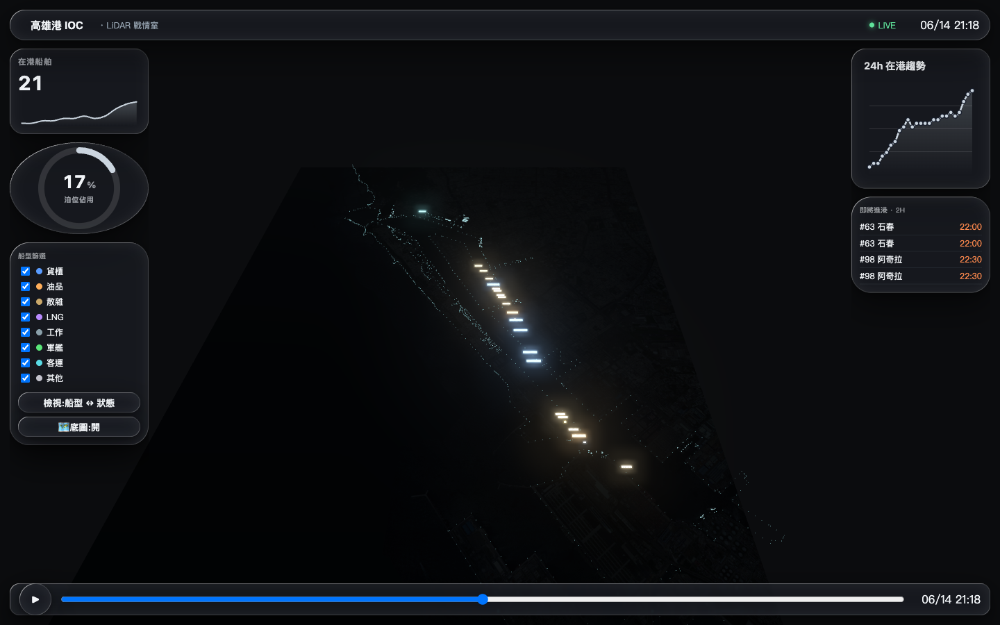
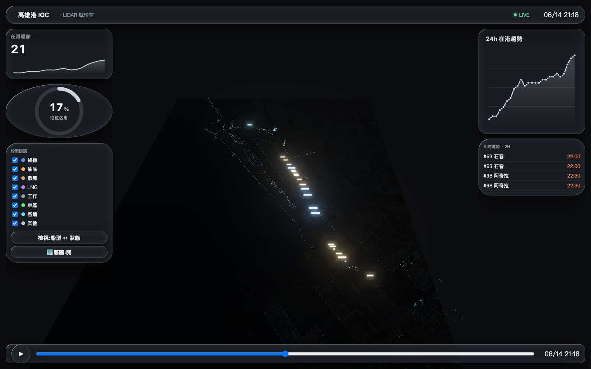

# VS Code 開發指南 — 高雄港 LiDAR 戰情室

針對本專案(Vite + TypeScript + Three.js + Liquid Glass HUD)的日常開發、視覺調校與除錯流程。

> **關於截圖**:下方「執行畫面」截圖是**實際跑起來的 App**(瀏覽器畫面)。VS Code 介面本身(擴充面板、F5 除錯列、內嵌 DevTools、測試側欄)屬於你編輯器的 GUI,無法從這邊截圖,因此以「哪個圖示、在哪裡」的文字精準描述。

---

## 0. 前置

- Node 18+ 與 npm 已安裝。第一次先在專案根目錄 `npm install`。
- 用 VS Code 開啟專案資料夾根目錄(含 `package.json` 那層)。

## 1. 專案結構地圖(先認識在哪改什麼)

分成兩塊:**可重用的渲染引擎**(`src/`)與**高雄港 App**(`examples/kaohsiung-port/`)。引擎是「加法擴充」——所有新功能預設關,洞穴 demo(`examples/basic/`)不受影響。

```
src/                              ← 引擎(@lidar 函式庫,可重用)
├── core/
│   ├── LidarEngine.ts            ← 場景/相機/render loop;bloom、fog、addLayer 等 options
│   ├── PointCloud.ts             ← GPU 點雲;colorMode、pulseHz、sizeAttenuation…
│   ├── postfx.ts                 ← selective bloom(多群組)、createSelectiveBloom
│   └── RaycastSampler / RingBuffer / types
├── shaders/points.vert|frag.glsl ← 點的著色器(類別色、霧、閃爍 uPulseHz)
├── ramps/                        ← 色階 / 類別 LUT(buildCategoryLUT…)
└── index.ts                      ← 對外匯出

examples/kaohsiung-port/          ← 戰情室 App
├── index.html                    ← 殼層:載 liquid-glass + theme.css + main.ts
├── main.ts                       ← 組裝:點雲層、bloom 群組、底圖、overlay、互動、__twin
├── ui/
│   ├── overlay.ts                ← 玻璃 HUD(navbar/側欄/時間軸/詳情卡)+ 折射修復
│   ├── theme.css                 ← 配色 token(--lg-tint / --ink / --signal-*)+ fade-rise
│   └── liquid-glass.css|js       ← vendored Liquid Glass Kit v0.1(勿手改;見 §3d)
├── palette.ts                    ← 船型 8 類別色、狀態色、valueFor
├── scene/portPoints.ts           ← 把船/海岸線取樣成點;TYPE_DIMS_M 船型尺寸
├── time/occupancy.ts             ← TWPort 泊位佔用、即將進港預報(純函式,有測試)
├── time/ais-replay.ts            ← F1 AIS 回放:positionAt 插值、vesselsInPortAt(有測試)
├── data/ais.ts                   ← F1 AIS 解析/bbox/聚合/清洗/類別對映(有測試)
├── data/join.ts                  ← F1 AIS↔TWPort join(IMO→呼號→船名)+ 類別(有測試)
├── geo/ · berths.ts              ← 經緯度投影(WORLD_SCALE)、碼頭線
└── data/                         ← 凍結快照 + 抓取腳本(TWPort/OSM/底圖/AIS;見 §7)
```

兩個可跑的頁面:
- 戰情室:`/examples/kaohsiung-port/index.html`(本指南主角)
- 引擎洞穴 demo:`/examples/basic/index.html`(驗證引擎沒被改壞)

## 2. 安裝建議擴充

專案已附 `.vscode/extensions.json`,打開專案時 VS Code 右下角會跳「安裝建議擴充」。或手動:**⌘ + ⇧ + X** → 搜尋框輸入 **`@recommended`** → 逐一安裝:

| 擴充 | 用途 |
|---|---|
| Microsoft Edge Tools (`ms-edgedevtools.vscode-edge-devtools`) | 在編輯器內開 DevTools;**改 CSS 自動寫回原始碼** |
| Vitest (`vitest.explorer`) | 測試側欄,行號顯示綠勾/紅叉 |
| Color Highlight (`naumovs.color-highlight`) | hex/rgba 行內顯示色塊 |
| Shader languages (`slevesque.shader`) | `.glsl` 語法高亮 |
| Error Lens (`usernamehw.errorlens`) | 錯誤直接顯示在該行行尾 |
| GitLens (`eamodio.gitlens`) | 行級 commit/blame |
| Prettier (`esbenp.prettier-vscode`) | 自動排版(選用) |

## 3. 啟動開發伺服器

### 方式 A — 只看畫面(最常用)

按 **⌃ + `**(Control + 反引號)開終端機:

```bash
npm run dev
```
```
  VITE v6.4.3  ready in 116 ms
  ➜  Local:   http://localhost:5173/
```

瀏覽器開:`http://localhost:5173/examples/kaohsiung-port/index.html`

**改 `.ts` / `.css` 存檔(⌘S)→ Vite 熱重載,瀏覽器即時更新**(`.css` 不重整即套用;`.ts` 觸發整頁重載)。

啟動成功應看到:



> 頂列:標題 / LIVE / 時鐘。左欄:範圍內 AIS 船數(統計卡)、在港/峰值(環形儀表)、船型篩選。右欄:在港船舶趨勢、即將進港(TWPort 預報)清單。底部:AIS 回放時間軸。中央 3D 點雲為主角,只有「船」會發光(selective bloom)。

### 方式 B — 下中斷點 Debug + 內嵌 DevTools

`.vscode/launch.json` 有兩個設定:
- **戰情室:Vite + Chrome**(預設、最通用)
- **戰情室:Vite + Edge**(可搭配 §4a 的 Edge DevTools 自動回寫 CSS)

1. 按 **F5**(切設定:左側 ▷「Run and Debug」→ 上方下拉)。
2. 它**自動先跑 `vite: dev` 任務**(等 `Local:` 出現)→ 開瀏覽器。
3. 在 `main.ts` / `ui/overlay.ts` 行號左側點紅點 = 中斷點。

> F5 卡在「正在執行 preLaunchTask」→ 多半 5173 被佔用,關掉舊終端機(見 §10)。選了 Edge 但沒裝 Edge → 改 Chrome 設定。

## 4. 視覺調校(亮度 / 大小 / 位置)

### 4a. Edge DevTools(改了自動回寫原始碼)

> 需 **Edge 瀏覽器 + Edge Tools 擴充**。只用 Chrome 跳到 §4b(效果一樣)。

F5(Edge 設定)後或點左側 **Edge Tools** 圖示 → **Elements / Console**。**CSS mirror editing**:在 Elements 改樣式 → 自動寫回 `ui/theme.css`(已設 `webRoot`)。

### 4b. DevTools Console 即時試(免重建,改動暫時、⌘R 還原)

> 第一次貼指令,瀏覽器要你先打一行 `allow pasting`。先確認 `__twin` 有回物件(見 §5)。

**亮度**
```js
__twin.setBasemapTint(0x101216)                 // 底圖更暗
__twin.mapPlane.material.opacity = 0.7; __twin.mapPlane.material.needsUpdate = true
__twin.mapPlane.visible = false                 // 底圖關掉
__twin.engine.scene.fog.color.setHex(0x0b0c0e)  // 霧 / 背景色
document.documentElement.style.setProperty('--lg-tint','rgba(26,29,35,0.9)') // 玻璃更不透
```
**船層閃爍與發光**(pulse 讓亮度脈動,連 bloom 一起閃)
```js
__twin.shipPC.setPulseHz(1)    // 船層每秒閃 1 次
__twin.shipPC.setPulseHz(0)    // 關閉脈動(預設)
```
**元件大小 / 位置**
```js
// 元素點選工具:DevTools 左上箭頭+方框(⌘⇧C)→ 點面板 → 該元素即變數 $0
$0.style.padding = '18px'; $0.style.width = '240px'
// 一次改同類($$ = querySelectorAll)
document.querySelectorAll('#overlay .lg-rail').forEach(r => r.style.width = '260px')
document.querySelectorAll('#overlay .lg-stat, #overlay .lg-card').forEach(e => e.style.padding = '16px')
```
例如把側欄加寬到 260px、玻璃 tint 調到 0.9:



### 4c. 永久生效的原始碼位置

**亮度 / 發光 / 配色** — 多在 `examples/kaohsiung-port/main.ts` 與 `ui/theme.css`:

| 想調 | 位置 | 說明 |
|---|---|---|
| **各群組 bloom** 強度 | `main.ts` engine `bloom: [ … ]` 陣列 | 每組 `{ layer, strength, radius, threshold }`(見 §4d) |
| 哪些層**發光** + 屬哪組 | 靜態層→`LAYERS` 的 `bloomGroup`;船→`main.ts` `engine.addLayer(shipPC.points, { bloom: 1 })` | 群1=船、群3=結構、群4=地標(F1 後已移除原群2 進港 3D 標記;進港改右欄清單) |
| 底圖明暗 / 透明度 | `main.ts` `buildBasemapPlane()` 的 `MeshBasicMaterial({ color, opacity })` | 色越小越暗 |
| 霧濃淡 / 距離 | `main.ts` engine `fog: { color, near, far }` | near 變小→霧更早起 |
| 玻璃面板透明度 | `ui/theme.css` `--lg-tint` | 第 4 值(alpha)越大→越暗實、字越清楚 |
| 文字 / 重點 / 警示色 | `ui/theme.css` `--ink` / `--lg-accent` / `--signal-warn` / `--signal-ok` | hex |
| 船型 8 類別色 | `palette.ts` `SHIP_CATEGORY_COLORS` | `[R,G,B][]`(資料層,場景主色) |
| 靜態層(碼頭/儲槽/起重機…)顏色 / 亮度 | `main.ts` `LAYERS` 各筆的 `color` / `brightness`(見 §4h) | `[R,G,B]` / 倍率(預設 1);設計上壓成中性讓船突出 |

**大小 / 位置** — 在 `ui/overlay.ts`(卡片內距在 `theme.css`):

| 想調 | 位置 | 現值 |
|---|---|---|
| 側欄寬度 / 上邊界 / 卡片間距 | `makeRail()` | `width:200px; top:70px; gap:12px` |
| 頂列 navbar 高度 / 位置 | `nav = bar(...)` | `top:14px; height:44px` |
| 底部時間軸 | `timeline = bar(...)` | `bottom:14px; height:46px` |
| 卡片內距 | `theme.css` | `#overlay .lg-stat, #overlay .lg-card { padding:12px }` |
| 環形儀表大小(正圓) | `gauge` 建立後設 `width=height` + `alignSelf:center` | 寬≠高會變橢圓 |
| 各卡片字級 | 各 `innerHTML` 的 `font-size` | 10 / 12px |
| 3D 取景距離 / 角度 | `main.ts` `dist` 與 `cameraPosition` | `dist = radius*1.0 + 15`(F1:不等比跟拉,放大世界才填滿畫面) |
| 船 點大小 | `main.ts` `shipPC` 的 `pointSize` / `maxPointSize` | 像素(`sizeAttenuation:false`) |
| 船 footprint 大小 / 去重疊 | `main.ts` `SHIP_FOOTPRINT`(見 §4i) | `0.6` = 真實 LOA 的 60% |
| 靜態層 點大小 | `main.ts` `LAYERS` 各筆的 `pointSize` / `maxPointSize`(見 §4h) | 像素 |
| 點雲各層高度(y 堆疊) | 靜態層→`LAYERS` 的 `baseY`(× S);船→`main.ts` `SHIP_Y = 0.5*S`;底圖→`buildBasemapPlane` 的 `position.set`(見 §4g) | 底圖 0 / 靜態 0(錨地 0.05*S)/ 船 0.5*S |

### 4d. 多群組 bloom(各層獨立發光參數)

引擎支援多個獨立 bloom 群組,用圖層編號區分。`main.ts`:
```ts
bloom: [
  { layer: 1, strength: 0.5,  radius: 0.12, threshold: 0.05 }, // 船(資料,主角)
  { layer: 3, strength: 0.05, radius: 0.1,  threshold: 0.0 },  // 結構(海岸線/碼頭/防波堤)
  { layer: 4, strength: 0.18, radius: 0.25, threshold: 0.0 },  // 地標(儲槽/起重機/錨地)
],
// 指派:靜態層用 LAYERS 的 bloomGroup;船用:
engine.addLayer(shipPC.points, { bloom: 1 });
```
- `strength` 光暈亮度、`radius` 擴散(0–1)、`threshold` 只有比它亮的像素發光。
- 想加群組:`bloom` 陣列加一筆 `{ layer: N, … }`,再 `addLayer(x, { bloom: N })`。
- 單一物件 `{ strength, radius, threshold }`(非陣列)= 一個群組在預設 `BLOOM_LAYER`(向後相容)。
- **目前 3 組**,強度刻意分主次:船(群1)> 地標(群4)> 結構(群3)。資料(船)最亮,基礎設施壓暗退背景。(F1 前另有群2 進港 3D 標記,已移除→進港改右欄 TWPort 預報清單。)

### 4e. 點雲閃爍(pulse)與顏色

`PointCloud` 的 `pulseHz` 讓該層**亮度脈動**(因為在 bloom 群組,光暈也會一閃一閃):
```ts
const pc = new PointCloud({ … , pulseHz: 1 }); // 建立時設;或執行期:
pc.setPulseHz(2);  // 改頻率;0 = 恆亮
```
顏色:給 `ramp: buildCategoryLUT([單一色])` 即單色層;多類別色(船)用 `SHIP_CATEGORY_COLORS`(`palette.ts`)。

### 4f. ⚠️ Liquid Glass 折射在重載後不顯影 — 已修,但要知道

**現象**:整頁重載(存 `.ts` / SPA)後玻璃面板只剩平面磨砂、**沒折射**;存一次 `theme.css` 就「突然出現」。
**根因**:折射用 SVG `<feImage>` 的 PNG data-URI 位移貼圖,Chromium **非同步解碼**,而 `backdrop-filter` 合成節點在首次繪製就定型、不會等解碼完重建——要一次**文件層級樣式重算**才會。
**已內建修復**(`ui/overlay.ts` 的 `reviveGlass()`):attach 後在頭幾秒多次「拆 backdrop-filter → 還原 → clone+cache-bust 換掉一個同源 `<link>`」強迫重算。所以**正常情況不用管**。
- 手動重觸發(改了面板、或想立即喚醒):Console 打 `__reviveGlass()`。
- 完整原理與 `reviveGlass` 程式碼寫在工具包的 `~/Desktop/UI-ToolBox/CLAUDE.md`「已知陷阱」一節。
- `prefers-reduced-motion` / 非 Chromium 走磨砂 fallback(`LiquidGlass.supported===false`),不受此問題影響、不需 revive。

### 4g. 點雲高度分層(y 軸:各層上下堆疊)

座標系:**北 = -z、東 = +x、上 = +y**。各層的「高度」就是它的 y 值。由下而上目前的堆疊:

| 層 | 目前 y | 永久生效的位置 |
|---|---|---|
| 航照底圖平面 | `0` | `main.ts` `buildBasemapPlane()` 的 `mesh.position.set(…, 0, …)` |
| 靜態層(海岸線/碼頭/防波堤/儲槽/起重機) | `baseY`(預設 `0`) | `main.ts` `LAYERS` 各筆的 `baseY` |
| 錨地圈 | `0.05*S` | `LAYERS` anchorage 的 `baseY` |
| 船舶點雲 | `0.5*S` | `main.ts` 常數 `SHIP_Y = 0.5*S`(`updateShips` 用,亦寫進 `centers.y`) |

> F4 之後 `Y_WATER` 已移除;靜態層高度改由各層 `LAYERS` 的 `baseY` 控制(3D 的儲槽/起重機從 `baseY` 往上長 `height`/`legHeight`)。

- **靜態層高度**:改該層 `LAYERS` 的 `baseY`。
- **船層高度**:改 `main.ts` 的 `SHIP_Y`(= `0.5*S`,`updateShips` 用)。
- **單位換算**:`WORLD_SCALE = 0.025`(1 單位 = 40m),所以 `SHIP_Y = 0.5*S = 1.25` ≈ 真實 50m 高。純視覺分層,別當公尺解讀。
- **改 `SHIP_Y` 會連帶影響點擊挑選**:`updateShips` 把同一個 `SHIP_Y` 寫進 `centers.y`,而點船是用 `centers` 投影到螢幕做最近距離比對——用同一常數(現況)即一致。
- Console 即時平移整層試:`__twin.shipPC.points.position.y = 3`(暫時,⌘R 還原)。

### 4h. 圖層 registry(每類別獨立點雲)

靜態地物改成**每類別一個獨立 PointCloud 圖層**,由 `main.ts` 頂部的 `LAYERS` 設定陣列(單一事實來源)+ `scene/layers.ts` 的 `buildLayers` 建出。每筆設定描述一個圖層的所有旋鈕。

| 欄位 | 說明 |
|---|---|
| `key` / `label` | 識別字 / 顯示名 |
| `source` | 對應 `osm` 的哪個欄位(coastline/piers/breakwater/tanks/cranes/anchorages) |
| `kind` | `line`(海岸線/碼頭/防波堤)、`cylinder`(儲槽 3D)、`gantry`(起重機 3D)、`zone`(錨地圈) |
| `color` | 單色 `[R,G,B]` 0–255 |
| `pointSize` / `maxPointSize` | 點大小 / 上限 |
| `brightness` / `pulseHz` | 亮度倍率(預設 1)/ 閃爍頻率(預設 0) |
| `bloomGroup` | 指派 bloom 群組(結構=3、地標=4) |
| `baseY` / `visible` | 基準高度 / 預設開關 |
| kind 專屬 | cylinder:`height`/`rings`/`perRing`;gantry:`legHeight`/`baseW`/`baseD`/`boomLen`/`spacing`;zone:`radius`/`ringCount`/`spacing`;line:`spacing` |

3D 點產生器在 `scene/landmarks.ts`(`sampleCylinderShell` 圓柱殼、`sampleGantry` 龍門骨架、`sampleZoneRing` 錨地圈,皆純函式可測)。

**Console 即時調(每層獨立)**:
```js
__twin.layers.tank.setVisible(false)        // 關掉儲槽
__twin.layers.crane.setColor([255,140,0])   // 起重機改橙
__twin.layers.coastline.setBrightness(1.5)  // 海岸線變亮
__twin.layers.breakwater.setSize(4)         // 防波堤點放大
__twin.layers.anchorage.setPulseHz(0.5)     // 錨地慢閃
__twin.layers.anchorage.setVisible(false)   // 錨地圈很大很亮,可關掉或調暗
```
新增/移除一個類別 = 改 `main.ts` 的 `LAYERS` 一筆設定。引擎 `PointCloud` 為此新增了 `setPointSize()`(會一併抬高 `uMaxPointSize` 上限)與 `setBrightness()`(`uBrightness` 倍率)。

### 4i. F1 真實 AIS 航跡 —— 可調旋鈕一覽

F1 用航港局 MPB 公開 AIS(免金鑰)以「錄製→凍結→回放」呈現真實船位。最常調的集中在 `main.ts` 頂部與 `geo/projection.ts`:

| 想調 | 位置 | 現值 / 說明 |
|---|---|---|
| **整體場景尺度**(港/船/地物一起) | `geo/projection.ts` `WORLD_SCALE` | `0.025`(1 單位=40m)。**只改這一個值**即可整體縮放;`main.ts` `S = WORLD_SCALE/0.01` 讓地物尺寸/間距/船高自動等比。放大後靠相機不等比跟拉(`dist=radius*1.0+15`)才填滿畫面。 |
| **船符號大小 / 去重疊** | `main.ts` `SHIP_FOOTPRINT` | `0.6` = 真實 LOA 的 60%;相鄰泊位船留白不糊在一起。要更開調小(如 0.45)。 |
| **開場時間**(預設停在哪刻) | `main.ts` 峰值掃描迴圈(算出 `peakInPort`/`nowMs`) | 開在「在港船數最多」時刻;時間軸範圍仍是完整 from→to。 |
| **靠泊判定**(誰算停泊) | `main.ts` `STATIONARY_U` | `100*WORLD_SCALE` = 軌跡淨位移 <100m 視為靠泊。 |
| **靠泊船對齊碼頭的距離上限** | `main.ts` `PIER_SNAP_MAX` | `300*WORLD_SCALE` = 離最近碼頭 <300m 才對齊朝向;更遠(錨地)維持航向不亂指。 |
| **進港預報視窗** | `main.ts` `INCOMING_WINDOW` | `6h` = 顯示快照基準後 6 小時內的 TWPort 預報。 |
| **進港預報基準時間** | `main.ts` `incomingRefMs` | = TWPort 快照 `capturedAtMs`,與 AIS 回放時鐘解耦、面板標題會顯示。**要當前預報就重跑 `npm run port:fetch`**(見 §7)。 |
| **港區範圍框**(過濾哪片海域) | `data/ais.ts` `KHH_BBOX` | `{s,n,w,e}` 經緯度。 |
| **AIS 欄位鍵名**(端點 schema 變動時) | `data/ais.ts` `K` | 各欄位候選鍵清單(已對準 MPB:ShipName/IMO_Number/Call_Sign/Ship_and_Cargo_Type/Record_Time)。 |
| **AIS type→8 類別對映** | `data/ais.ts` `mapAisTypeToCategory` | join 不到 TWPort 時的粗對映;join 到優先用 TWPort 船型。 |
| **回放播放速度** | `main.ts` `play()` 內 `(toMs-fromMs)/600` | 每 80ms 推進量;÷600 ≈ 50s 掃完全程。 |

**誠實邊界(F1)**:① 回放是真實 AIS 取樣點間線性插值;② 此 feed 有 COG 無 heading → 靠泊船朝向靠碼頭線對齊、移動船用點間方位角;③ 船 footprint 為 60% 示意尺寸(非精確);④ 進港 = TWPort 官方預報(基準時間顯示在標題);⑤ MPB 端點需台灣 IP。

### 4j. F3 碼頭/分區標籤

F3 在場景上疊一層 **troika-three-text SDF billboard** 標籤,按鏡頭距離自動分三層顯示:遠→分區、中→終端機(terminal)、近→碼頭(berth)。以下整理常調旋鈕。

#### Console 即時控制

`__twin.labels` 提供下列把手(須等場景載入後才有效):

```js
// 切換各層顯示
__twin.labels.setTierVisible('district', false)   // 關掉分區標籤
__twin.labels.setTierVisible('terminal', true)    // 開啟終端機標籤
__twin.labels.setTierVisible('berth', true)       // 開啟碼頭標籤

// 強制刷新(e.g. 改了 camera 想立即更新不透明度)
__twin.labels.update(__twin.engine.camera3D)

// 釋放 GPU 資源(切換場景時)
__twin.labels.dispose()

// 所有 billboard 標籤的容器(可直接操作 .visible / .position 等)
__twin.labels.group   // Three.js Group,所有 Text billboard 的 flat 集合(無子 Group);用 setTierVisible() 切換各層
```

#### 調校旋鈕(原始碼)

**距離帶(LOD)**:`examples/kaohsiung-port/scene/portZones.ts` 的 `DEFAULT_BANDS`:

```ts
export const DEFAULT_BANDS: LodBands = {
  district: [fadeInStart, fullStart, fullEnd, fadeOutEnd],  // 遠鏡頭顯示分區名
  terminal: [fadeInStart, fullStart, fullEnd, fadeOutEnd],  // 中距離顯示終端機
  berth:    [fadeInStart, fullStart, fullEnd, fadeOutEnd],  // 近距離顯示碼頭號
};
```

四值皆**世界單位**(WORLD_SCALE = 0.025,1 單位 ≈ 40m):
- `fadeInStart`→`fullStart`:淡入區間(opacity 0→1)
- `fullStart`→`fullEnd`:全可見
- `fullEnd`→`fadeOutEnd`:淡出區間(opacity 1→0)

`dist>fadeOutEnd` 時不可見;`dist<fadeInStart` 時也不可見。三層的帶彼此獨立,遠帶負責 district、中帶負責 terminal、近帶負責 berth。

**main.ts 標籤常數**:

| 常數 | 位置 | 說明 |
|---|---|---|
| `nearRadius` | `main.ts` 頂部 | 近鏡頭判定半徑(世界單位),影響 berth 帶是否觸發 |
| `yLift` | `main.ts` 頂部 | 標籤 y 軸偏移(往上抬離地平面,避免被點雲遮擋) |
| `fontSizes.district` | `main.ts` 頂部 | 分區標籤字級(troika worldUnits) |
| `fontSizes.terminal` | `main.ts` 頂部 | 終端機標籤字級 |
| `fontSizes.berth` | `main.ts` 頂部 | 碼頭標籤字級 |
| `color` | `main.ts` 頂部 | 標籤主色(hex string,如 `'#e0e8ff'`) |
| `outlineColor` | `main.ts` 頂部 | 描邊色(SDF outline,加強對比;`'#000000'`) |

Console 即時試:
```js
// 抬高所有標籤(暫時)
__twin.labels.group.position.y = 2
// 臨時改透明度門檻(程式碼層): op > 0.01 的才畫 → 改 > 0 可消除淡入邊緣 1-frame stale
```

#### 資料更新:`npm run port:berths`

碼頭座標來自 **KHB 官方 GetMarker**(POST `https://sdci.twport.com.tw/khbweb/osmx2.aspx/GetMarker`):

```bash
npm run port:berths   # 抓取 → bbox-filter KHH → 累積 append → data/berths-khh.json
```

**重要**:GetMarker 每次只回傳**當前有船佔用**的船席,空泊位不在回傳內 → 資料是「累積式」的。**多跑幾次(港口忙碌不同時段)才能覆蓋更多碼頭**。已預先 bake 了 72 個 KHH 船席(`data/berths-khh.json`)。改了 KHH 地理範圍需同步改 `data/fetch-berths.ts` 的 `KHH_BBOX`。

`data/berths-khh.json` 格式:
```json
{ "capturedAtMs": 1750000000000, "berths": [{ "code": "1001", "lat": 22.61, "lon": 120.27, "angle": 166, "nameZh": "立揚" }, ...] }
```

#### 字型子集化

標籤字型 `examples/kaohsiung-port/data/fonts/zones-subset.woff` 是 **Noto Sans TC** 的子集,限縮到分區名稱字元 + `0-9` + `#` + **`A-Z`**(碼頭碼可能含字母,如 `26B`;少了字母會在畫面顯示 tofu □)以降低包體。

**標籤文字格式**:terminal(貨櫃中心)層顯示**純數字 1–7**(+ `洲際`/`海事`),非「第N貨櫃中心」;個別碼頭層用 `shortBerthLabel()` 去掉 `1` 系列前綴顯示俗稱碼頭號(`1066`→`66`、`1201`→`201`、`126B`→`26B`;`0003`/`4021`/`4049` 維持原碼避免碰撞)。district 仍用完整商港區名。

若改了 `portZones.ts` 的 `PORT_ZONES` label 文字,需重跑子集化(charset 需涵蓋所有 label 字元 + `0123456789#` + `A-Z`):

```bash
# 先取得 Noto Sans TC OTF(如從 Google Fonts 下載)
pyftsubset NotoSansTC-Regular.otf \
  --text="<所有 PORT_ZONES label 字元 + 0123456789# + ABCDEFGHIJKLMNOPQRSTUVWXYZ>" \
  --flavor=woff \
  --no-hinting --desubroutinize \
  --output-file=examples/kaohsiung-port/data/fonts/zones-subset.woff
```

缺字會顯示 tofu(□),是「字型子集不含該字」的訊號 → 更新子集即可。

#### 誠實邊界(F3)

- GetMarker 僅回傳**有船佔用的船席**,空泊位沒座標 → berth 層覆蓋率受佔用狀況而定(72/已知 ~121)。
- LOD 距離度量目前是**相機到場景原點的 3D 距離**(含高度):若使用者拉高仰角,altitude 分量會影響距離計算、可能提早觸發 tier 切換 → 必要時切換為 XZ 平面距離(詳見 Task 9 後續)。
- `ANGLE`(船席方位角)已從 GetMarker 取得但 v1 未使用(billboard 朝相機,非朝船席朝向)。

---

## 5. `__twin` 除錯把手(Console)

`main.ts` 把這些掛在 `window.__twin`(+ `overlay.ts` 掛 `window.__reviveGlass`):

| 把手 | 用途 |
|---|---|
| `__twin.engine` | `LidarEngine`(`.scene` / `.camera3D` / `.renderer`) |
| `__twin.shipPC` | 船層 `PointCloud`(`.setPulseHz`、`.points.material.uniforms`…) |
| `__twin.layers.<key>` | 六個靜態圖層的 handle(coastline/pier/breakwater/tank/crane/anchorage);`.setVisible/.setColor/.setBrightness/.setSize/.setPulseHz` |
| `__twin.labels` | F3 碼頭/分區標籤 handle;`.setTierVisible('district'|'terminal'|'berth', on)` / `.update(camera)` / `.dispose()` / `.group`(Three.js Group) |
| `__twin.mapPlane` | 航照底圖 mesh(`.visible` / `.material.opacity`) |
| `__twin.setBasemapTint(0x……)` | 即時改底圖染色 |
| `__twin.updateShips(tMs, mode, enabled?)` | 重建船層(某時刻、type/status、篩選集) |
| `__twin.refresh(tMs)` | 重整到某時間(同拖時間軸) |
| `__twin.play() / pause()` | 自走回放開關 |
| `__twin.fromMs / toMs / nowMs / peakInPort` | AIS 時窗起訖 / 開場時刻 / 峰值在港數 |
| `__twin.tracks / trackMeta / shipCenters` | AIS 軌跡 / per-track 快取(類別/join/靠泊/朝向)/ 目前船中心 |
| `__reviveGlass()` | 強制重觸發玻璃折射合成 |

例:`__twin.refresh(__twin.nowMs + 6*3600000)`(跳到 6 小時後)。

## 6. 測試 / 型別檢查 / 打包

```bash
npm test          # vitest 一次跑完(目前 27 檔、154 測試)
npm run test:watch  # 監看模式,改檔即重跑
npx vitest run test/postfx.test.ts   # 只跑單檔
npx tsc --noEmit -p tsconfig.json    # 全專案型別檢查(0 錯才算過)
npm run build     # vite 打包 + tsc 宣告(出 dist/)
```
- 左側 **Testing**(燒杯)→ Vitest 列出全部測試,點 ▷ 跑單一個、可下中斷點 debug。
- **能測的是純邏輯**(`time/occupancy.ts`、`postfx` 的可見度輔助、`PointCloud` uniforms…);**bloom / 玻璃折射 / 動畫無法單元測**,只能瀏覽器目視(headless 也渲染不出 SVG 折射)。
- 裝 **Error Lens** 後 tsc 錯誤顯示在該行行尾;**Color Highlight** 在 `theme.css` / `palette.ts` 行內顯示色塊。

## 7. 資料管線(真實資料,凍結快照)

App 讀**凍結快照**(可重現、無執行期金鑰)。要更新資料:
```bash
npm run port:fetch    # 高雄港 TWPort 指泊/預報 → data/snapshots/khh-YYYY-MM-DD.json
npm run port:osm      # OSM 海岸線 + 碼頭/防波堤/儲槽/起重機/錨地 → data/osm-khh.json
npm run port:basemap  # NLSC 航照烘焙成 data/basemap-khh.jpg(+ .json bounds;需 sharp)
# --- F1 真實 AIS(需台灣 IP)---
npm run port:ais:probe   # 探 MPB 端點、印欄位、存 _probe-sample.json(首次 / schema 變動時用)
npm run port:ais:record  # 韌性輪詢 MPB AIS,append → data/ais-tracks/raw-khh-<date>.jsonl(跑一段時間後 Ctrl-C;24h 在另一台機長跑)
npm run port:ais:export  # raw .jsonl 聚合/清洗 → data/ais-tracks/khh-<date>.json(app 讀最新一份)
```
HUD 數字來源:**在港數 / 趨勢**由 `time/ais-replay.ts` 從 AIS 軌跡算;**即將進港**由 `time/occupancy.ts` 從 TWPort 預報算(基準=快照時間,標題顯示);**船位**為真實 AIS(`ais-replay.ts` 插值)。皆無造假動畫。raw `.jsonl` 與 `_probe-sample.json` 已 gitignore,只 commit 短窗 `khh-*.json`。

## 8. 常用快捷鍵(Mac)

| 鍵 | 作用 |
|---|---|
| ⌃ + ` | 開 / 關終端機 |
| F5 | 啟動 Debug(自動跑 vite) |
| ⌘ + ⇧ + P | 命令面板(打 `Run Task` 可單獨跑 `vite: dev`) |
| ⌘ + ⇧ + C | DevTools 元素點選工具 |
| ⌘ + P | 快速開檔 |
| ⌘ + S | 存檔(觸發熱重載) |
| ⌘ + ⇧ + V | Markdown 預覽(看本指南帶圖) |
| ⌘ + ⇧ + X | 擴充面板 |

**戰情室 app 內相機操作**:滑鼠左鍵拖曳=環繞、滾輪=縮放、右鍵拖曳=平移;**↑↓←→ 方向鍵=沿地面平面持續平移視角中心**(上下=前後、左右=側移,無垂直分量;自寫於引擎 `applyKeyboardPan`,`main.ts` 的 `keyboardPan: true` / `keyPanSpeed: 0.8` 速度因子可調)。

## 9. 典型開發循環

1. `npm run dev`(或 F5)。
2. 改 `overlay.ts` / `theme.css` / `main.ts` → ⌘S → 瀏覽器即時更新。
3. 微調:Edge DevTools(自動回寫)或 Console 試 `__twin` / `$0` / `__reviveGlass()`。
4. 把滿意的值填回 §4c 的原始碼位置。
5. 收尾:`npm test` + `npx tsc --noEmit` 全綠 → commit。

## 10. 出問題時

| 症狀 | 處理 |
|---|---|
| 瀏覽器打不開 / 連線拒絕 | 確認 `npm run dev` 還在跑、網址含 `examples/kaohsiung-port/index.html` |
| `__twin` 是 undefined | 跑錯網址或還沒載完 → ⌘R 重整 |
| 玻璃面板沒折射(重載後) | 已內建 `reviveGlass`(§4f);若仍沒出來,Console 打 `__reviveGlass()`;非 Chromium 走磨砂 fallback 屬正常 |
| 環形儀表變橢圓 | gauge 寬≠高 + `border-radius:50%`;設 `width=height` 即正圓(§4c) |
| F5 卡「正在執行 preLaunchTask」/ port 5173 被佔用 | 已有 dev server 在跑;關掉舊終端機,或手動法:先 `npm run dev`,再把 `launch.json` 的 `"preLaunchTask"` 那行刪掉後 F5 |
| F5 報「問題模式無效」 | `tasks.json` 的 problemMatcher 已修(需有 `file`/`message` 捕捉群組) |
| F5 找不到瀏覽器 | 選了 Edge 但沒裝 → 改「Vite + Chrome」設定 |
| 改了沒反應 | 確認有存檔(⌘S);CSS 變數要改 `:root` 或 `setProperty` |
| 洞穴 demo 壞了 | 引擎改動應為「加法、預設關」;檢查 `examples/basic/index.html` 是否仍正常 |

## 11. 延伸閱讀

- 設計 spec / 實作計畫:`docs/superpowers/specs/` 與 `docs/superpowers/plans/`(F0 戰情室、F2 航照底圖…)
- 交接總覽:`docs/superpowers/2026-06-14-handoff.md`
- Liquid Glass Kit 規格 + 已知陷阱:`~/Desktop/UI-ToolBox/CLAUDE.md`
